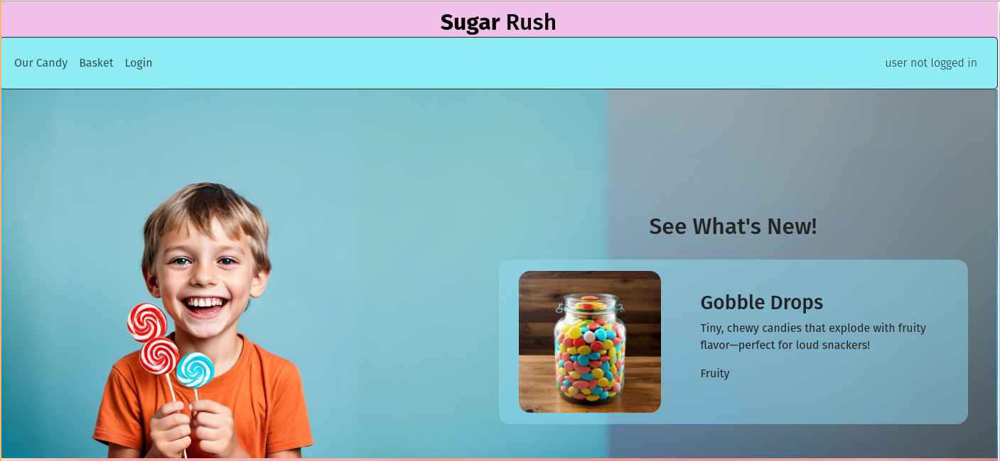
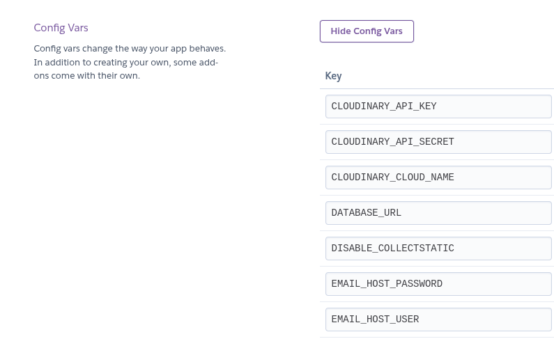
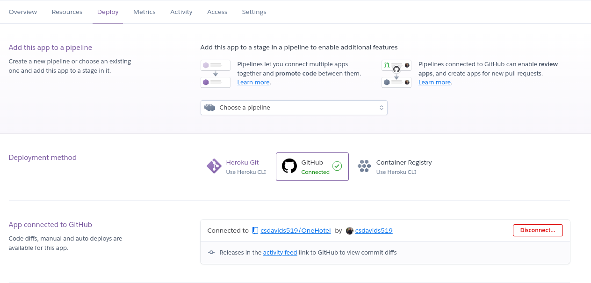
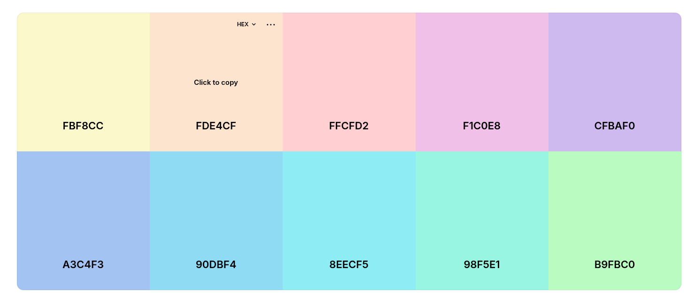
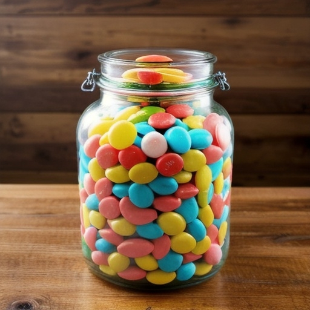

# E-commerce website

## About

Candy Rush is an e-commerce website that allows customers to buy unique candy products. It utilizes a log in system that maintains the shopping basket data for each user.
users can see new and popular candy items on the home page that might spark their interest. Once in the 'Our Candy' section of the website, the full selection of candy products is shown, users can opt to select 'quick buy' to quickly add an item to their shopping cart. Or click the product to view more details and add multiple quantities to the basket at once.
Once shoppers are happy with their candy selections, we have a simple checkout process, where users will be given an opportunity to make edits to the basket and confirm, then enter their desired shipping data, this data is saved and stored for the users next purchase so the checkout process is made even more easy with auto completed shipping forms. 
at the payment screen users can see the current basket items and their total and given a selection of payment options to use via Stripe. Once completed a notification is displayed as well as a conformation email is sent with the order info.

The live site can be found here: [Sugar Rush](https://sugar-rush-7a055e26dddb.herokuapp.com/)

The github repository can be found here: [GitHub](https://github.com/csdavids519/SugarRush)

The project agile task list can be found here: [Github Projects](https://github.com/users/csdavids519/projects/4)

Payment testing credit card number: 4242 4242 4242 4242

Admin testing at Code Institute
  User: SugarRushAdmin
  Pass: Admin1

---

## Deployment to Heroku

This project was deployed with Heroku.

Steps to deploy on Heroku:

1. Create Heroku account
2. Via settings link a Config Vars variable to the data base
  
3. In Deploy tab connect to the GitHub repo.
  
4. choose automatic or manual deployments
5. Choose a branch to deploy
6. Deploy project

## UX

The website was designed with UX in mind to create a very simple to navigate store, with fun and fun color selections resembling that of a candy store. Managers have use of the back end database where they can edit product details and other important data in a professional looking environment. 

### Target Audience

This website is intended for people interested in purchasing products online, starting from bread and finishing electronics, such as TV, smartphones, or other products. It was also aimed to lure people into using this website in their daily lives. This was achieved by implementing a discount system for all customers, additional discounts for loyal customers, and a notification system that allows users to be notified when a product is available. This website may hold many products, and it is essential to make sure that the website is easy to use and navigate. 

Sugar Rush is aimed towards children without becoming off putting adults. As the candy selection is geared towards groups of all ages, its important the younger target audience also finds some joy in selecting their candy.

### User Stories

User stories and project progress has been recorded with github 

view the kanban board here:
[github projects](hhttps://github.com/users/csdavids519/projects/4/views/1)

---

## Business Model

The Business Model is B2C, meaning that the company sells products to customers only.
It focuses on individual transactions only.

### A Persona Summary of the customer

Candy Rush is focused on a wide group of people of all types and ages, for this reason the store is designed to have a fun look without compromising on functionality.

### A persona summary of the store personnel

Candy Rush, although fun looking is still a serious and professorial company for this reason the admin section of the web site maintains a business first style approach.

### Strategy Trade-Off

Sugar Rush creates and sells its own unique candy, offering candy products only found at Sugar Rush

- product availability;
- product quality;
- product choice;
- good user experience;

---

## Web Marketing

Facebook and other social media accounts have been created for Sugar Rush as a way to increase reach to existing and potential customers.

---

## Future Development

### Sorting products by type and taste

At Candy Rush as our product offerings selection grows we plan to implement a type and taste sorting feature so users can more quickly find what interests them regarding sweet, sour, gummy ect.

### Third-party registration

Allowing users to use Facebook or Google accounts to sign in would improve the user experience and allow for new customers to quickly sign up.

### Monthly basket offers

This feature requires more research time to implement, as the Candy Rush store grows with the offerings we wish to implement an option for users to subscribe to a monthly random basket of candy automatically shipped to their door.

### Delivery cost calculation

A benefit to our customers would be to calculate shipping cots before checkout, this feature would need to be researched before implemented and would use the already available shipping info data from the customer.

---

## Technologies used

- ### Languages

  - [Python 3.11](https://www.python.org): the primary language used to develop the server-side of the website.
  - [JS](https://www.javascript.com/): the primary language used to develop interactive components of the website.
  - [HTML](https://developer.mozilla.org/en-US/docs/Web/HTML): the markup language used to create the website.
  - [CSS](https://developer.mozilla.org/en-US/docs/Web/css): the styling language used to style the website.

- ### Frameworks and libraries:

  - [Django](https://www.djangoproject.com/): python framework used to create all the logic.

- ### Databases:

  - [SQLite](https://www.sqlite.org/): was used as a development database.
  - [PostgreSQL](https://www.postgresql.org/): the database used to store all the data.

- ### Other tools:

  - [Git](https://git-scm.com/): the version control system used to manage the code.
  - [Pip3](https://pypi.org/project/pip/): the package manager used to install the dependencies.
  - [Gunicorn](https://gunicorn.org/): the web server used to run the website.
  - [Psycopg2](https://www.psycopg.org/): the database driver used to connect to the database.
  - [Django-allauth](https://django-allauth.readthedocs.io/en/latest/): the authentication library used to create the user accounts.
  - [Django-crispy-forms](https://django-cryptography.readthedocs.io/en/latest/): was used to control the rendering behavior of Django forms.
  - [GitHub](https://github.com/): used to host the website's source code.
  - [VSCode](https://code.visualstudio.com/): the IDE used to develop the website.
  - [Chrome DevTools](https://developer.chrome.com/docs/devtools/open/): was used to debug the website.
  - [Font Awesome](https://fontawesome.com/): was used to create the icons used in the website.
  - [Coolors](https://coolors.co/202a3c-1c2431-181f2a-0b1523-65e2d9-925cef-6b28e0-ffffff-eeeeee) was used to make a color palette for the website.
  - [W3C Validator](https://validator.w3.org/): was used to validate HTML5 code for the website.
  - [W3C CSS validator](https://jigsaw.w3.org/css-validator/): was used to validate CSS code for the website.
  - [JShint](https://jshint.com/): was used to validate JS code for the website.
  - [PEP8](https://pep8.org/): was used to validate Python code for the website.
  - [stripe](https://stripe.com/): was used to create the payment system.
  - [Sitemap Generator](https://www.xml-sitemaps.com/) was used to create the sitemap.xml file.
  - [Cloudinary](https://cloudinary.com/) was used to serve the images.
  - [temp-mail](https://temp-mail.org/) Was used to assist with testing email functions.
  - [ERD](https://www.xml-sitemaps.com/) Was used to create the site map.
  - [Table Generator](https://www.tablesgenerator.com/markdown_tables) Was used to create tables for the readme file.

---

## Features

- Users are greeted with a colorful home page that shows some popular and new product offerings at Candy Rush
- Users can quickly view the full offerings from the store via navbar links.

### First Time Customers

### User Login / New User Sign up

- For first time customers, a sign up page is available to create a new account that automatically creates a basket and order tracking in the back end for the user.
- Conformation emails are sent to ensure the new users have access to the email account.
- Current logged in status as well as current basket cost total is visible at all times in the top right corner of the site.

### Products

- The 'Our Candy' navigation button links the user to the full list of candy products on offer.
- Users have the option to select 'quick buy' to quickly add the single item to the basket.
- Product Detail page is found buy clicking a product, this links the user to a more detailed description of the product and allows for adding multiple quantities to the basket.

### Basket

- User shopping is tracked via the 'basket' page, where users can see what they have currently collected for purchase.
- Basket is the start of the payment checkout process and allows users to edit quantities or fully remove items before committing to the purchase.

### Shipping Info

- The shipping info page is the second step in the checkout process
- Users are asked for their desired shipping information
- The process is made easier for returning users as their previous shipping details will be automatically pre-loaded in the shipping form.

### Payment

- On the payment page users are once again able to view their current basket contents and order total
- Using the Stripe payment system users are then able to enter payment details and complete the purchase

### Success

- after a successful payment users are sent to the success page so it is clear the order process has been completed.
- Users are sent an email with details regarding their purchase.

---

## Design

Candy Rush uses a minimalistic but fun approach to design. This helps keep the 'fun' candy store feeling but does not allow the design to interfere with a smooth and easy shopping process.

### Color Scheme

Sugar Rush color scheme was chosen based off images of real life candy stores. This color scheme creates a fun and playful environment that should be expected when buying a fun treat.

  

### Imagery

- all images on Candy Rush have been developed with the help of  OPEN ART
- images chosen for the main page background are to convey the message of happy children with candy to match the theme of the candy store.

  
  

- all images of the candy have also been developed with OPEN ART  to depict a unique container of candy.

  
  

### Wire frames

  [Sugar Rush Wireframes](documentation/images/wire_diagram_1.pdf)
  [Sugar Rush Wireframes](documentation/images/wire_diagram_2.pdf)

---

## Agile Methodology

### GitHub Project Management

  

GitHub Project Management was used to manage the project. This method keeps clear what tasks are the current most pressing to be done items.

---

## Information Architecture

### Database

- During the earliest stages of the project, the database was created using SQLite.
- The database was then migrated to PostgreSQL.

### Entity-Relationship Diagram

---

## Testing

### Manual Tests

I have manually tested this project with the following tests:

| **Tests**                                    | **Passed** | **Comments**                                                                               |
|----------------------------------------------|------------|-------------------------------------------------------------------------------------------|
| **GENERAL SOFTWARE TESTS**                   |            |                                                                                           |
| HTML validation                              | X          | Passed Markup Validation Service without any errors not related to Django Template Language. |
| CSS validation                               | X          | Passed CSS Validation Service without errors.                                              |
| Check code runs in local terminal            | X          | One Hotel runs in the local Python terminal.                                              |
| Check code runs on Heroku                    | X          | One Hotel is deployed and running on Heroku.                                              |
| Deployed version is latest main branch       | X          | Deployed version is up to date.                                                           |
| Deployed version has DEBUG set to FALSE      | X          | Deployed version of Hotel One has DEBUG value set to FALSE.                               |
| Code comments are checked                    | X          | Code has correct comments on functions; no code is commented out unnecessarily.           |
| **HOME PAGE**                                |            |                                                                                           |
| All links are working                        | X          | All links are connected to the correct URL path.                                          |
| All buttons are working                      | X          | All buttons perform the correct action.                                                   |
| All text is rendered correctly               | X          | All text is clear and visible.                                                            |
| Page is responsive                           | X          | Page responds to screen size.                                                             |
| All images are loading                       | X          | All images are loading correctly.                                                        |
| **CHECKOUT PAGES**                           |            |                                                                                           |
| All links are working                        | X          | All links are connected to the correct URL path.                                          |
| All buttons are working                      | X          | All buttons perform the correct action.                                                   |
| All text is rendered correctly               | X          | All text is clear and visible.                                                            |
| Page is responsive                           | X          | Page responds to screen size.                                                             |
| All images are loading                       | X          | All images are loading correctly.                                                        |
| **PRODUCT PAGES**                            |            |                                                                                           |
| All links are working                        | X          | All links are connected to the correct URL path.                                          |
| All buttons are working                      | X          | All buttons perform the correct action.                                                   |
| All text is rendered correctly               | X          | All text is clear and visible.                                                            |
| Page is responsive                           | X          | Page responds to screen size.                                                             |
| All input fields are working                 | X          | All inputs work correctly and display errors on blank or wrong format.                    |
| Booking function creates new booking code    | X          | New bookings are created, and the user is notified of the booking code.                   |
| Room card displays correctly                 | X          | All text on the room card is displayed correctly.                                         |
| **LOGIN, LOGOUT, REGISTER PAGES**            |            |                                                                                           |
| All links are working                        | X          | All links are connected to the correct URL path.                                          |
| All buttons are working                      | X          | All buttons perform the correct action.                                                   |
| All text is rendered correctly               | X          | All text is clear and visible.                                                            |
| Page is responsive                           | X          | Page responds to screen size.                                                             |
| All input fields are working                 | X          | All inputs work correctly.                                                                |
| Log out functions correctly                  | X          | Users can log out with a message response.                                                |
| Log in functions correctly                   | X          | Users can log in with a message response and status at the top-right header.              |
| Register new user is possible                | X          | New users can be created on the Register page.                                            |

#### HTML Validator (ignore errors due to Django HTML)

| Base      | Passed  |
|-----------|---------|
| base.html | X       |
| 404.html  | X       |
| 500.html  | X       |

| Checkout      | Passed |
|---------------|--------|
| checkout.html | X      |
| payment.html  | X      |
| shipping.html | X      |
| success.html  | X      |

| Home          | Passed |
|---------------|--------|
| index.html    | X      |

| Products            | Passed |
|---------------------|--------|
| product_detail.html | X      |
| products.html       | X      |

| account                      | Passed |
|------------------------------|--------|
| account_inactive.html        | X      |
| base.html                    | X      |
| email_confirm.html           | X      |
| email.html                   | X      |
| login.html                   | X      |
| logout.html                  | X      |
| password_change.html         | X      |
| password_reset_done.html     | X      |
| password_reset_from_key_done | X      |
| password_reset.html          | X      |
| password_set.html            | X      |
| signup_closed.html           | X      |
| signup.html                  | X      |
| verification_sent.html       | X      |
| verified_email_required.html | X      |

| email                        | Passed |
|------------------------------|--------|
| purchase_confirmation.html   | X      |

### Code Validation Tests

- Sugar Rush passes HTML and CSS validation without any errors that are unrelated to Django specific projects.
- HTML pages are checked with [Markup Validation Service](https://validator.w3.org/)
- CSS code was checked with [CSS Validation Service](https://jigsaw.w3.org/css-validator/)
- Python code has been check with a linter extension [Flake8](https://flake8.pycqa.org/en/latest/)

---

## Credits

- [GitHub](https://github.com/) for giving the idea of the project's design.
- [Django](https://www.djangoproject.com/) for the framework.
- [Font awesome](https://fontawesome.com/): for the free access to icons.
- [Postgresql](https://www.postgresql.org/): for providing a free database.
- [Stripe](https://stripe.com/): for providing a free payment gateway.
- [fontawesome](https://fontawesome.com/): for providing free icons.
- [googlefonts](https://fonts.google.com/): for providing free fonts.
- [Favicon Generator.](https://favicon.io/): for providing a free platform to generate favicons.
- [Sitemap Generator](https://www.xml-sitemaps.com/): for providing a free platform to generate sitemaps.
- [Coolors](https://coolors.co/): for providing a free platform to generate your own palette.

cloudinary

### Media

- [OpenArt](https://openart.ai/home) was used to develop all images found in the Candy Rush project.

## Acknowledgments

- [Iuliia Konovalova](https://github.com/IuliiaKonovalova) Who has been a knowledgeable and encouraging mentor on this project.
- [Matt Freire](https://youtu.be/722A27IoQnk?si=antWjX7mLXuBnL_1) For assistance with Stripe payment system integration
- [Michael Herman](https://testdriven.io/blog/django-stripe-tutorial/) For assistance with Stripe payment system integration

## Additional Resources

- [Django for Beginners 5th Edition](https://www.amazon.de/Django-Beginners-5th-Modern-Applications/dp/173546726X) - A resource for general Django topics.
- [Django 5 by Example](https://www.packtpub.com/en-us/product/django-5-by-example-9781805122340) - Additional examples on how to create Django apps.
- [ChatGPT](https://chatgpt.com/) - Quick resource to help with any page errors.
- [StackOverflow](https://stackoverflow.com/) - as a resource for 'how to' when things get challenging.